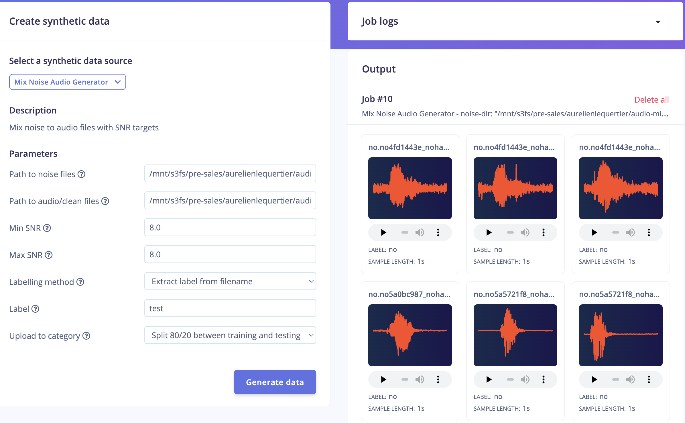
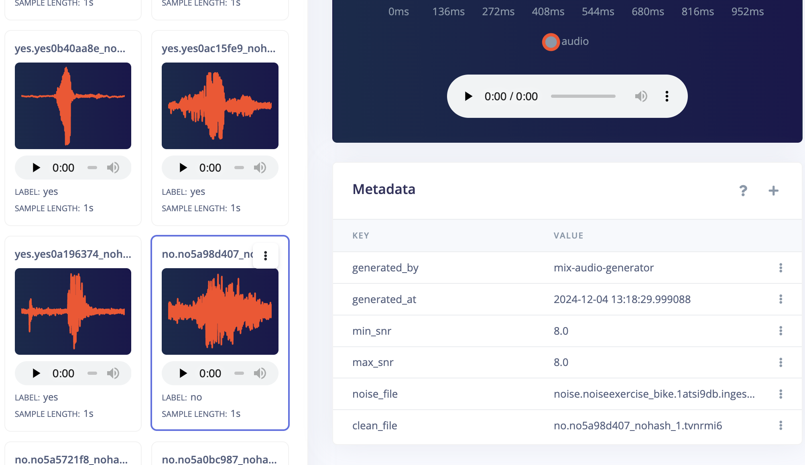

# Audio Mix Noise Generator Block for Edge Impulse

This is a transformation block that uses [audiomentations](https://github.com/iver56/audiomentations) library to mix audio files with noise files to a specific SNR.

## How does this block works

The block adds noise to all files from the audio directory. For each audio file, some random noise file is selected and mixed with to an SNR target between min and max values (uniform distribution). For a fixed SNR, use the same value for min and max.

Each new generated sample is applied a label based on the labelling method and extra metadata is also added (generation date, SNR values, original audio and noise files).

### Parameters passed to the block:

* **Path to noise files:** Bucket path/prefix with noise files (ie: /mnt/s3fs/noise_dir/)
* **Path to audio/clean files:** Bucket path/prefix with audio files (ie: /mnt/s3fs/audio_dir/)
* **Min SNR:** min SNR value (ie 3.0)
* **Max SNR:** max SNR value (ie 5.0) 
* **Labelling method:** 'auto' or 'manual'. If 'auto' is selected, label is extracted from the filename such as _\<label\>.\<rest-of-filename\>.wav_
* **Label:** will be used only for 'manual' labelling method
* **Upload to category:** how to split generated samples between training and test sets 

_Synthetic data block config_


_Generated metadata_


## How to run (Edge Impulse Studio)

###  Using the Synthetic Data feature (Enterprise)

You can modify this repository or just push it as a new custom Synthetic Data transformation block.

1. Install the [Edge Impulse CLI](https://docs.edgeimpulse.com/docs/tools/edge-impulse-cli).
2. Open a command prompt or terminal, and navigate to this folder.
3. Create a new transformation block:

```
$ edge-impulse-blocks init

In which organization do you want to create this block? Aurelien Demo Org
Attaching block to organization 'Aurelien Demo Org'
```

4. Push the block:

```
$ edge-impulse-blocks push
```

5. Mount bucket to your Synthetic Data block:
    * Go to your Edge Impulse organization.
    * Head to the "Synthetic Data" Blocks area under "Custom Blocks" and edit your uploaded block
    * Click the + icon next to "Additional Mount Points" and choose "Bucket". Set the mounting location as _/mnt/s3fs/_
    * Save the block.

6. You can now access your modified block from **Data acquisition > Synthetic data** on any enterprise project.

## How to run (locally)

First, copy noise and audio files to _input/_ subdirectories.

### Using python script

1. Install the dependencies:

    ```
    pip3 install -r requirements.txt
    ```

2. Run the generate script:

    ```
    python3 transform.py --noise-dir input/noise_dir --audio-dir input/audio_dir --min-snr 3.0 --max-snr 5.0 --skip-upload --labelling-method auto
    ```

3. Generated files will be written to the _output_ folder.

### Using Docker

1. Build the docker container

```
docker build -t mix-audio-block .
```

2. Run the container and provide your Edge Impulse Project API Key:

```
docker run --rm -it -v $PWD:/app -e EI_PROJECT_API_KEY='YOUR_API_KEY' mix-audio-block --noise-dir input/noise_dir --audio-dir input/audio_dir --min-snr 3.0 --max-snr 5.0 --labelling-method auto
```

3. Generated files will be sent to your Edge Impulse project, including metadata.


## Note: --synthetic-data-job-id argument / x-synthetic-data-job-id header

If you want to build your own custom Synthetic Data block, you'll need to parse the (optional) `--synthetic-data-job-id` argument. When uploading data to the ingestion service you need to then pass the value from this argument to the `x-synthetic-data-job-id` header. [transform.py](transform.py) implements this. This is required so we know which job generated what data, and is used to render the UI on the Synthetic Data page.
